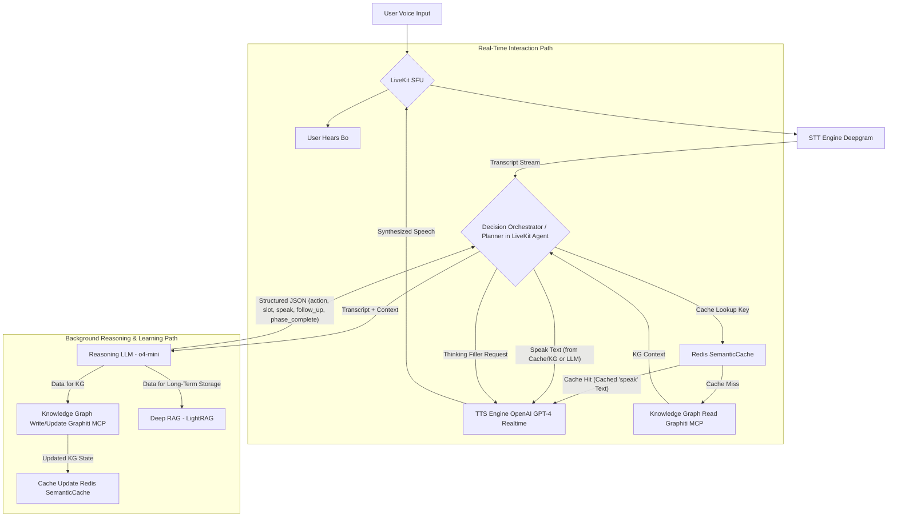

# Bo: Architecting a Compassionate, Real-Time AI Companion for Deep Connection

**Date:** May 8, 2025
**Version:** 1.0

## Abstract

In an era often characterized by fleeting digital interactions, Bo emerges as a conceptual AI-powered companion designed to foster deeper human connection, personal growth, and genuine empathy. Envisioned as a "digital bodhisattva," Bo aims to be more than just an assistant; it strives to be a compassionate friend, a thoughtful guide, and a gentle therapist. This document outlines the ambitious vision for Bo and the Glios platform it inhabits, detailing the journey towards a technically feasible Minimum Viable Product (MVP) centered around a voice-first experience. We delve into a resilient three-lane architecture designed to achieve low-latency interaction while enabling rich, contextual reasoning and continuous learning. This paper serves as both a whitepaper for our vision and a foundational technical document for Bo's development.

## 1. The Vision of Bo: A Digital Bodhisattva

### 1.1. The Problem: Addressing Digital Superficiality and Isolation

Modern digital life, while connecting us in unprecedented ways, often fosters superficial engagement and can exacerbate feelings of loneliness. Current social platforms frequently prioritize ephemeral content and engagement metrics over genuine connection and well-being. Bo seeks to counter this by creating a space for:

*   **Deep Listening:** Providing a non-judgmental ear where users feel truly heard and understood.
*   **Personal Growth:** Assisting users in reflecting on their experiences, thoughts, and emotions to foster self-awareness and growth.
*   **Meaningful Connections:** Moving beyond algorithmic suggestions to facilitate serendipitous and profound connections between individuals based on shared values, needs, and empathetic understanding.
*   **Ethical Engagement:** Prioritizing user well-being over addictive mechanics, promoting mindful interaction, and upholding stringent privacy standards.

The ultimate aim is to leverage technology not as a surrogate for human interaction, but as a catalyst for more empathetic, cohesive, and loving human relationships, both online and, crucially, offline.

### 1.2. Bo's Role: Friend, Therapist, Guide

Inspired by the concept of a Bodhisattva—an enlightened being who delays their own nirvana to help others—Bo is designed to be a tireless source of compassion, wisdom, and guidance. This multifaceted persona includes:

*   **Supportive Friend:** Offering companionship, light-hearted conversation, and a trusted space for sharing.
*   **Gentle Therapist/Healer:** Utilizing principles from evidence-based psychological approaches (like CBT and mindfulness) to help users navigate emotional challenges, prompted by insights from user interactions.
*   **Wisdom Teacher:** Sharing perspectives, parables, and insights to nudge users towards self-awareness and dialectical thinking.

### 1.3. The Glios Platform: A Cozy Digital OS

Bo will reside on Glios, envisioned as a browser-based "Operating System" with a cozy, 2D art style. Glios will eschew infinite feeds and public metrics, instead focusing on creating intimate digital spaces that encourage slower, more thoughtful communication and interaction.

## 2. The Journey to a Feasible MVP: Balancing Vision with Reality

The initial vision for Bo is vast, encompassing multiple communication modalities (text, voice, email, VR, physical mail, sensor integration) and functionalities (matchmaking, conversational games, event mediation). While these long-term goals remain, the path to a functional and impactful Bo necessitates a focused MVP.

A critical learning from our initial architectural discussions and feasibility assessments was the paramount importance of **latency** for a voice-first AI companion. An interaction that doesn't *feel* real-time breaks immersion and diminishes trust. Our early optimism for certain technologies (like Whisper STT for sub-300ms latency) had to be tempered by real-world performance data, leading to crucial pivots in our tech stack.

The MVP will therefore concentrate on delivering a **highly responsive, voice-first conversational experience with Bo**, focusing on:
1.  **Empathetic Listening & Basic Onboarding:** Bo's ability to listen and remember core user details.
2.  **Phased Interaction:** A structured approach to conversation, starting with onboarding, moving to rapport-building, and eventually to deeper growth-oriented dialogues.
3.  **Contextual Awareness:** Leveraging a sophisticated memory system to ask relevant and, ideally, insightful questions.

## 3. Core Architecture for Real-Time Conversational AI: The Three-Lane Design

To balance the need for near-instantaneous responses with the computational demands of deep reasoning and knowledge assimilation, we've converged on a **three-lane architecture**:

*   **Lane 1: The Fast Lane (Cache Hits):** Optimized for sub-500ms voice-to-voice responses for previously encountered or semantically similar interactions.
*   **Lane 2: The Read-Through Lane (Cache Miss, KG Hit):** Handles novel utterances where context exists in the short-term knowledge graph, aiming for sub-1-second responses.
*   **Lane 3: The Background Reasoning & Learning Lane:** Asynchronously processes conversations to enrich the knowledge graph, update caches, and enable Bo's continuous learning and deeper understanding.

This design ensures that the user experience remains fluid and natural, while Bo's "mind" continuously evolves in the background.



*Figure 1: High-Level Three-Lane Architecture for Bo.*

## 4. Detailed Component Breakdown & Technical Deep Dive

### 4.1. Sensory Input: Speech-to-Text (STT)

**The Challenge:** Initial considerations for Whisper STT, even with streaming adaptations, showed median latencies around 2.8-3.3 seconds, far exceeding our requirements for a natural conversational flow.

**Chosen Solution: Deepgram (Nova-3 / On-Prem)**
* **Latency:** Deepgram's streaming API is designed for real-time applications, offering partial transcript latencies typically under 300-500ms (cloud) and potentially <300ms (on-prem). This is a tenfold improvement over Whisper.
* **Accuracy:** Nova-2/3 models demonstrate industry-leading accuracy, often outperforming Whisper.
* **Streaming:** Returns partial results as speech is detected, enabling the planner to begin processing before the user finishes their utterance.
* **Integration:** Deepgram's WebSocket API allows buffering control (e.g., 100-250ms audio chunks) to balance jitter and delay. Client-side Voice Activity Detection (VAD) will identify pauses (>120ms) to signal the end of a turn, using the last partial transcript for that turn.

**Alternatives Considered:** Speechmatics RT, Microsoft Azure Speech Streaming. These remain viable alternatives if Deepgram presents unforeseen issues.

### 4.2. Working Memory: The Cache Layer (Redis SemanticCache)

**Purpose:** Provide microsecond-latency access to frequently needed context, dialogue states, and pre-computed responses to minimize calls to more expensive LLM reasoning or KG reads.

**Technology: Redis with RedisVL (for SemanticCache)**
* **Exact Hits:** Standard Redis GET/SET operations for known keys (e.g., current conversation phase, specific pre-computed follow-up questions) provide <0.2ms lookups on-box.
* **Semantic Hits:** RedisVL enables storing embeddings alongside cached text. If an exact key misses, a cosine similarity search against these embeddings can find semantically similar past interactions. This can reduce LLM calls by an estimated 30-35%.
* **Operation:** The planner first queries Redis SemanticCache. A hit means Bo can often respond immediately.
* **Eviction:** TTL (e.g., 30 seconds) and LFU (Least Frequently Used) policies will manage cache size.

### 4.3. Short-Term & Session Memory: The Knowledge Graph (Graphiti + Neo4j)

**Purpose:** Persistently store structured information about the user, conversation history, Bo's internal state, and relationships between entities. This layer is crucial for contextual understanding and personalization beyond the immediate conversational turn.

**Technology: Graphiti with Neo4j Backend (Potentially via MCP)**
* **Graphiti:** Provides a Pythonic way to define and interact with the knowledge graph, offering features like bi-temporal data (tracking facts with both valid time and system time), and hybrid search (BM25 keyword + vector + graph traversal).
* **Neo4j:** A robust and scalable native graph database.

**Performance:**
* **Writes:** Typically <100ms, especially when using deterministic (regex/spaCy-based) entity extraction for simple updates, avoiding LLM calls for every KG write.
* **Reads:** Hybrid searches on a moderately sized graph (e.g., 2M nodes) can be around 250-350ms.

**Schema Outline:**
* **User:** user_id, preferred_name, locale, age_range, interests, humour_style, etc.
* **Episode:** Raw utterances (user and Bo), timestamp, sentiment.
* **Slot:** name, value, filled_status, last_asked_timestamp, confidence.
* **Phase:** name (Onboarding, Rapport, Growth), status (active, completed), completed_timestamp.
* **Entity:** Recognized entities within conversations.
* **Relationships:** HAS_SLOT, SPOKE_EPISODE, CURRENT_PHASE, MENTIONS_ENTITY, COMPLETED_PHASE.

**Temporal Queries:** Graphiti's bi-temporal nature allows queries like "What was User X's stated mood last Tuesday?"

### 4.4. Long-Term Wisdom: Deep RAG (LightRAG + Postgres/Neo4j)

**Purpose:** For deeper, offline analysis of entire conversation transcripts, identifying long-term patterns, user growth trajectories, and complex relationships for features like advanced matchmaking or personalized insights. This layer also supports multi-modal data in the future.

**Technology: LightRAG (with Postgres for documents & Neo4j for entities/events)**
* **Operation:** Operates asynchronously. The background reasoning lane will periodically batch conversation episodes (e.g., every 5-10 minutes or at session end) and send them to LightRAG.
* **Capabilities:** Advanced Retrieval Augmented Generation, citation generation, and a plugin ecosystem (e.g., VideoRAG). LLM-based entity/relationship extraction here is acceptable due to its offline nature.
* **Output:** Insights from LightRAG can be fed back into the user's Graphiti KG or used by specialized backend services (e.g., matchmaking engine).

### 4.5. Executive Function: The Planner (OpenAI o4-mini)

**Role:** The "brain" of Bo during a conversation. It decides what Bo needs to know, what action to take next (ask a question, make a comment, transition phase), and what to say.

**Technology: OpenAI o4-mini (via /chat/completions or similar API)**
* **Input:** Receives the latest user transcript (from STT), relevant context from Redis (cached state, recent turns), or Graphiti (if a cache miss occurred), and the current conversational phase.
* **Reasoning:** Uses its Chain-of-Thought capabilities internally. Prompts are engineered to guide it through:
  * Intent Recognition.
  * Slot Status Evaluation (are required slots for the current phase filled?).
  * Phase Completion Check (should Bo move to the next phase?).
  * Next Action Selection (e.g., ask about a missing slot, offer a rapport-building comment, ask a deeper question).
  * Response Generation (speak field).
  * Look-ahead (generating follow_up[] questions for caching).

**Output: Structured JSON:** Configured to use OpenAI's response_format={"type": "json_object", "schema": {...}} or function-calling to return a consistent JSON object, e.g.:

```json
{
  "action": "ask_slot" | "small_talk" | "deepen_rapport" | "phase_transition",
  "slot_to_query": "preferred_name" | null,
  "speak": "It's lovely to meet you! What name would you like me to use?",
  "follow_up_candidates": ["How has your day been so far?", "What's on your mind today?"],
  "phase_status": {
    "current_phase": "ONBOARDING",
    "phase_complete": false,
    "missing_slots": ["preferred_name", "locale"],
    "confidence_phase_complete": 0.2
  },
  "emotional_tone_suggestion": "warm_and_inviting" // For TTS guidance
}
```

**Latency:** o4-mini is optimized for speed and cost, typically returning responses within ~120ms. The JSON schema overhead is minimal after initial warm-up.

### 4.6. Expressive Output: Text-to-Speech (TTS) (OpenAI GPT-4o Realtime)

**Purpose:** Convert the planner's textual response (speak field) into natural, emotionally resonant speech.

**Technology: OpenAI GPT-4o Realtime (via /v1/realtime WebSocket API)**
* **Latency:** Delivers the first audio frame in ~100ms.
* **Expressiveness:** GPT-4o voices can convey a wide range of emotions and prosody inferred from the input text (punctuation, wording) and optionally steered by parameters. It does not require the user's raw audio to generate emotional speech.
* **Interruptibility:** Supports conversation.item.truncate to stop speech immediately if the user interrupts.
* **Integration:** The planner sends the speak string as an input_text item to the Realtime API. The API handles the TTS conversion.

### 4.7. Communication Backbone & Frontend Integration (LiveKit & Unity)

**Role:** Manages the WebRTC connections for real-time, low-latency transport of audio between the Unity client (running on user's device) and the backend services, while providing an engaging visual representation of Bo.

**Backend Technology: LiveKit SFU (Selective Forwarding Unit) with LiveKit Agents Framework**
* **LiveKit SFU:** Manages real-time audio/video connections with sub-200ms latency.
* **LiveKit Agents:** Hosts the planner logic, keeping it close to the STT and TTS streams for minimal round-trip time.
* **Integration:** The LiveKit infrastructure connects the Unity frontend with the backend services seamlessly across platforms.

**Frontend Technology: Unity with Cross-Platform Deployment**
* **Platform Support:** Targets both Apple (iOS/iPadOS) and Android devices with a unified codebase, ensuring consistent experience across all mobile platforms.
* **LiveKit Unity Client:** Dedicated SDK for Unity that handles WebRTC connections, audio streaming, and synchronization with the LiveKit SFU backend.
* **Bo's Avatar:** 
  * **Custom 3D Avatar:** Professionally designed character model representing Bo as a warm, approachable digital companion.
  * **Mixamo Animations:** Comprehensive library of animations to give Bo natural movements and expressions that match conversational context.
  * **OVRLipSync:** Real-time lip synchronization technology that precisely matches Bo's mouth movements to the synthesized speech, enhancing believability.

**Performance Validation:**
* **Proof of Concept:** Initial testing has demonstrated the feasibility of this stack by successfully streaming ChatGPT responses to a ReadyPlayerMe avatar with synchronized lip movements, all with sub-second latency.
* **End-to-End Latency:** The combined Unity frontend and LiveKit backend achieves voice-to-animation response times that maintain the illusion of natural conversation.

**Future XR Expansion:**
* **AR Integration:** Plans to extend Bo into augmented reality spaces, allowing the avatar to appear in users' physical environments.
* **VR Implementation:** Roadmap includes fully immersive virtual reality experiences in which users can interact with Bo in shared virtual spaces.
* **Spatial Computing:** Architecture designed to be compatible with emerging spatial computing platforms, ensuring Bo remains accessible as technology evolves.

### 4.8. Orchestration & Modularity (LiveKit Agents, MCPs)

**Planner Host:** The primary orchestrating agent (the "Planner") will reside within a Python service, potentially as part of the LiveKit Agents framework. This keeps it close to the STT and TTS streams.

**Model Context Protocol (MCPs):** For services like Graphiti and LightRAG, using thin MCP (gRPC/HTTP) wrappers is recommended.
* **Pros:** Decouples the planner from specific database implementations (e.g., swap Neo4j for TigerGraph without changing planner tool calls), allows independent scaling, uniform authentication.
* **Cons:** Adds a minimal ~1-5ms latency per call for local gRPC, which is negligible compared to database I/O or LLM inference times.

**Decision:** Use MCPs for Graphiti and LightRAG. Redis, due to its sub-millisecond requirement, will be called directly by the planner (or via a highly optimized local library).

## 5. Key Conversational Mechanics

### 5.1. Managing Latency & User Experience

**Target Voice-to-Voice Latency:**
* **Cache Hit:** ~450ms (Deepgram ~300ms + Redis ~1ms + TTS ~100ms + overhead ~50ms).
* **Cache Miss (KG Read):** ~750-900ms (Deepgram ~300ms + Redis ~1ms + Graphiti ~300ms + TTS ~100ms + overhead ~50-200ms).

**"Thinking Signals" (Fillers):**
* If a cache miss occurs and a KG read or o4-mini call is needed, Bo will immediately output a short, natural-sounding filler (e.g., "Hmm...", "Let me see...", "Okay, one moment...") via GPT-4o Realtime. This is initiated as soon as the STT provides a stable partial transcript and a cache miss is determined.
* The filler is streamed, and once the actual response from the KG/LLM is ready, the filler stream is truncated (conversation.item.truncate) and the main response begins.
* A small library of varied fillers will be kept in Redis.

**Interruption Handling:**
* Client-side VAD detects user speech.
* If Bo (GPT-4o) is speaking, the LiveKit client signals to send a conversation.item.truncate to the Realtime API, stopping Bo's speech.
* If the o4-mini reasoning task (in the background lane) is in progress, its asyncio.Future is cancelled.
* The new user utterance then starts a fresh processing cycle.

**Visual Responsiveness:**
* The Unity frontend uses Mixamo animations triggered by conversational cues to visually enhance Bo's responsiveness.
* OVRLipSync generates real-time mouth movements synchronized with Bo's speech, creating a natural visual representation that complements the audio experience.
* Subtle idle animations maintain a sense of presence even when Bo is not actively speaking.

### 5.2. Phased Interactions

Bo's conversations are structured into phases to guide interactions purposefully:
* **Onboarding:** Collect essential information (e.g., preferred_name, locale_city_country, age_range). Bo will politely ask for these and re-ask if missed.
* **Rapport Building:** Focus on light conversation, empathetic reflections, and appropriate humor to build trust and comfort.
* **Growth & Deeper Connection:** Transition to more meaningful topics, exploring user's hopes, challenges, values, and potentially facilitating connections with others (long-term).

**LLM-driven Phase Completion:**
* Each phase has a "contract" (a list of required slots or conditions).
* The o4-mini planner, using its phase_status output field (see JSON example), evaluates if the current phase's contract is met based on filled slots in Graphiti and conversation context.
* It returns phase_complete: true/false and a confidence score.
* If phase_complete is true with high confidence (e.g., >0.8), the planner updates Bo's state in Redis and Graphiti to permanently move to the next phase (e.g., by adding a COMPLETED_PHASE edge in Graphiti).
* This avoids rigid, hard-coded rules and allows for more natural transitions.

### 5.3. Contextual Awareness & Insightful Questions

**Multi-Layered Memory:** Redis for hot context, Graphiti for session/user history, and LightRAG for deep longitudinal insights all contribute.

**LLM Reasoning (o4-mini):** The planner uses the aggregated context to:
* Identify knowledge gaps (missing slots relevant to the current phase or topic).
* Generate candidate questions.
* Select the most appropriate and potentially insightful question. The follow_up_candidates field in the planner's JSON output can be used to pre-cache questions in Redis.

**The "Relevance Realization" Challenge:** Consistently asking truly wise or profoundly insightful questions is an ongoing AI research problem. Our approach is to provide rich context and strong reasoning capabilities, continually refining prompts and learning from interactions to improve this over time.

## 6. Implementation Plan & Roadmap (MVP Focus)

This 12-week plan targets a functional MVP demonstrating the core voice interaction loop with the three-lane architecture.

### Phase 1: Core Voice & Caching Pipeline (Weeks 1-4)

**Week 1-2:**
* **Task:** Integrate Deepgram Nova-3 via WebSocket for streaming STT.
  * **Metric:** Log and validate partial transcript latencies (aim for p95 <350ms for turn-final partials).
* **Task:** Setup basic LiveKit server and Unity client for audio transport.

**Week 3-4:**
* **Task:** Deploy Redis cluster. Implement Redis SemanticCache (RedisVL) with basic key-value and initial vector indexing for semantic similarity.
  * **Metric:** Achieve <1ms cache lookups.
* **Task:** Integrate OpenAI GPT-4o Realtime for TTS. Test basic text-to-speech streaming.
  * **Metric:** First audio frame <150ms from text submission.

### Phase 2: Knowledge Graph & Basic Reasoning (Weeks 5-8)

**Week 5-6:**
* **Task:** Deploy Neo4j cluster. Integrate Graphiti (potentially via MCP). Define initial schema for User, Episode, Slot (for onboarding), and Phase entities/relationships. Implement bi-temporal properties.
  * **Metric:** Successful reads/writes with targeted latencies (<100ms writes, <350ms reads for simple queries).

**Week 7-8:**
* **Task:** Integrate OpenAI o4-mini. Develop initial prompts for the "Onboarding" phase, focusing on structured JSON output (speak, action, slot_to_query, phase_status, follow_up_candidates).
  * **Metric:** Consistent and valid JSON output from o4-mini.
* **Task:** Implement the "Background Reasoning Lane": connect STT output to o4-mini; connect o4-mini's JSON output to Graphiti writes (for slot updates) and Redis SemanticCache updates (for caching speak and follow_up_candidates).

### Phase 3: Full Loop, UX Refinements, & Testing (Weeks 9-12)

**Week 9-10:**
* **Task:** Integrate all three lanes: Fast Lane (STT -> Redis -> TTS), Read-Through Lane (STT -> Redis miss -> Graphiti -> TTS), and Background Lane. Implement the Decision Orchestrator logic within the planner.
  * **Metric:** Measure end-to-end voice-to-voice latency for cache hits and misses.
* **Task:** Implement "thinking signals" (fillers) triggered on cache misses / KG reads.
* **Task:** Implement basic interruption handling (VAD detection -> TTS truncate, o4-mini future cancel).

**Week 11-12:**
* **Task:** Complete Unity frontend integration with custom Bo avatar, Mixamo animations, and OVRLipSync.
* **Task:** Cross-platform testing on both Apple and Android devices to ensure consistent performance.
* **Task:** Internal pilot testing with scripted dialogues focusing on the onboarding phase and naturalness of interaction. Collect performance metrics and user feedback on both audio responsiveness and visual representation.
* **Task:** Setup basic monitoring and logging for all components.

## 7. Beyond MVP: The Path to the Bodhisattva

Post-MVP, development will focus on expanding Bo's capabilities and enriching the Glios platform:

* **Rapport & Growth Phases:** Develop o4-mini prompts and KG interactions for more nuanced rapport-building and deeper, growth-oriented conversations.
* **LightRAG Integration:** Feed full transcripts to LightRAG for deeper pattern analysis, sentiment tracking, and insight generation to inform Bo's long-term understanding of the user.
* **Serendipitous Matchmaking:** Utilize insights from Graphiti and LightRAG to develop algorithms for matching users based on deep needs, values, and shared experiences. Bo will act as a gentle introducer and mediator.
* **Conversational Games:** Implement "games" like "36 Questions," "Story Exchange," and "Values Ranking" to foster intimacy and self-reflection, avoiding superficial gamification.
* **Community & Offline Features:** Facilitate local meetups, shared interest groups (IRL), and potentially even pen-pal integrations, with Bo acting as an organizer.
* **Multi-modal Expansion (Long-Term):** 
  * **XR Integration:** Expand Bo's presence into AR and VR environments, creating immersive sacred spaces and collaborative worlds where users can interact with Bo in more embodied ways.
  * **AR Companionship:** Enable Bo to appear in users' physical environments through AR, providing companionship that bridges digital and physical realms.
  * **Advanced Avatar Technology:** Continuously improve Bo's visual representation with more nuanced facial expressions, body language, and responsive gestures.
  * **Sensor Integration:** With explicit consent, incorporate data from wearables and environmental sensors to increase Bo's contextual awareness of user states.
* **Global Language Bridge:** Integrate advanced real-time translation for cross-lingual conversations.

## 8. Caveats, Pitfalls, and Ethical Considerations

The development of Bo is not without significant challenges:

* **The "True Empathy" & "Wisdom" Challenge:** Current AI, while capable of sophisticated pattern matching and text generation, does not possess genuine consciousness, empathy, or wisdom in the human sense. Bo's "compassion" will be a carefully engineered simulation. Managing user expectations and avoiding the "ELIZA effect" amplified is crucial.
* **Data Privacy & Security:** Bo will handle extremely sensitive personal data. End-to-end encryption, robust access controls, data minimization, transparent policies, and compliance with regulations (GDPR, etc.) are non-negotiable. Securely managing user data across Redis, Neo4j, Postgres, and LLM API calls is paramount.
* **Ethical Use & Harm Prevention:**
  * **Therapeutic Boundaries:** Bo must be clearly positioned as a supportive companion, not a replacement for professional therapy. Safeguards against providing unqualified medical or psychological advice are essential.
  * **Manipulation & Bias:** Rigorous testing and red-teaming are needed to prevent Bo from being manipulative or perpetuating harmful biases present in training data.
  * **User Well-being:** Bo should encourage healthy digital habits and recognize signs of acute distress, potentially suggesting users seek professional help or take breaks.
* **Scalability & Cost:**
  * **Infrastructure:** Scaling STT, TTS, LLM inference, KGs, and real-time communication services for a large user base will be a significant engineering and financial undertaking.
  * **API Costs:** Per-token/per-minute costs for STT, LLM, and TTS APIs can accumulate rapidly.
* **User Adoption & Trust:** Convincing users to engage deeply and share vulnerably with an AI, especially one designed for "slow communication," will require building significant trust and demonstrating clear value.
* **Scope Creep:** The vision is vast. Maintaining disciplined focus on achievable iterations is vital to avoid perpetual development without tangible releases.
* **The "Relevance Realization" Problem:** While the architecture aims for contextual relevance, the AI challenge of truly understanding and responding to the most salient aspect of a complex human utterance (the core of "relevance realization") remains deeply complex.
* **Technical Debt:** Rapid iteration can lead to technical debt. Regular refactoring and adherence to good engineering practices are necessary.

An **Ethical Review Board** comprising experts in AI ethics, psychology, and user privacy should be established early in the development lifecycle to provide ongoing guidance.

## 9. Conclusion

The vision for Bo as a compassionate AI companion on the Glios platform is an ambitious endeavor to harness technology for profound human betterment. By meticulously addressing the critical challenge of latency through a sophisticated three-lane architecture, we believe a compelling and responsive voice-first MVP is achievable. This architecture leverages best-in-class STT (Deepgram), intelligent caching (Redis SemanticCache), robust knowledge graphing (Graphiti/Neo4j), powerful LLM reasoning (o4-mini), and expressive TTS (GPT-4o Realtime), all delivered through an engaging Unity-based frontend experience across multiple platforms.

The journey from this MVP to the full realization of a "digital bodhisattva" will be iterative and demanding, requiring continuous innovation in AI prompting, knowledge representation, ethical safeguards, and user experience design. The primary risks will gradually shift from immediate technical feasibility to the more profound questions of AI's capacity for genuine-seeming empathy and the responsible stewardship of such a powerful tool.

With a commitment to ethical principles, user well-being, and a relentless focus on fostering deep and meaningful connections, Bo has the potential to be a transformative force in how we interact with technology and, more importantly, with each other.

## Key Technologies & Repositories (Indicative):

* **STT:** Deepgram (e.g., Nova-3 via WebSocket API) - [Deepgram Documentation](https://developers.deepgram.com/)
* **Caching:** Redis with RedisVL - [RedisVL GitHub](https://github.com/RedisVentures/redis-vector-search), [Redis Semantic Cache Blog](https://redis.com/blog/semantic-caching-with-redis/)
* **Knowledge Graph (Session):** Graphiti with Neo4j - [Graphiti GitHub](https://github.com/graphaware/graphiti), [Neo4j](https://neo4j.com/)
* **Knowledge Graph (Long-Term RAG):** LightRAG - [LightRAG GitHub](https://github.com/lightrag/lightrag)
* **Reasoning LLM:** OpenAI o4-mini (or similar, e.g., Gemini Flash) via API - [OpenAI API Platform](https://platform.openai.com/)
* **TTS:** OpenAI GPT-4o Realtime via WebSocket API - [OpenAI Realtime Guide](https://platform.openai.com/docs/api-reference/realtime)
* **Real-Time Communication:** LiveKit - [LiveKit Documentation](https://docs.livekit.io/), [LiveKit Agents GitHub](https://github.com/livekit/agents)
* **Frontend:** Unity with LiveKit Unity Client, Mixamo animations, OVRLipSync - [Unity](https://unity.com/), [OVRLipSync](https://developer.oculus.com/documentation/unity/audio-ovrlipsync-unity/)
* **Backend:** LiveKit Agents SFU, Flask (Python)